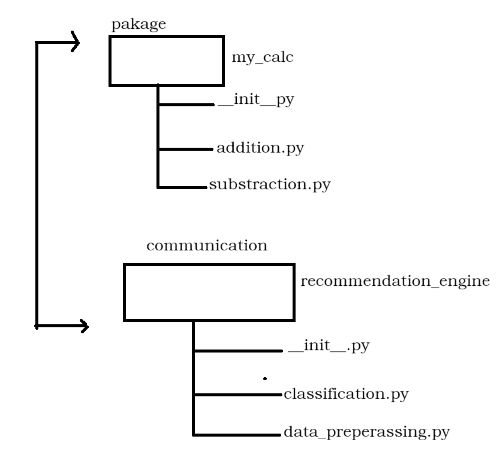

# Python Project Structure Documentation

This project demonstrates how to create and organize Python packages, modules, and scripts. Below you will find a full explanation of the folder structure, purpose of each file, and an included architecture diagram.

---

## 📁 Project Structure

```
PYTHON/
│
├── PACKAGE_TESTING/
│   └── my_Calcutator/
│       ├── __init__.py
│       ├── addition.py
│       ├── substraction.py
│       └── main.py
│
├── asseet/
│   └── image.png
│
├── hello.py
├── main.py
├── my_module.py
├── pythonh-note.txt
├── Python_practice.ipynb
└── sample.py
```

---

## 🖼️ Package Diagram

Below diagram is stored at:

```
assect/image.png
```



This image visually explains how Python packages and modules connect.

---

## 📦 `PACKAGE_TESTING/my_Calcutator` Package

This is a custom Python package demonstrating how to structure code into modules.

### **1. `__init__.py`**

Marks the folder as a Python package. It allows importing modules like:

```python
from my_Calcutator.addition import add
```

### **2. `addition.py`**

Contains functions related to addition.
Example content:

```python
def add(a, b):
    return a + b
```

### **3. `substraction.py`**

Contains subtraction-related functions.
Example:

```python
def subtract(a, b):
    return a - b
```

### **4. `main.py`**

This file imports functions from other modules and runs them.
Example:

```python
from addition import add
from substraction import subtract

print(add(10, 5))
print(subtract(10, 5))
```

---

## 🗂️ Other Python Files

### **`hello.py`**

Simple testing script, usually prints messages or tests functions.

### **`main.py`** (root folder)

Another example driver file separate from the package folder.

### **`my_module.py`**

A module that may contain custom functions used for testing.

### **`sample.py`**

General-purpose file for experimentation.

### **`Python_practice.ipynb`**

A Jupyter Notebook used to test Python concepts interactively.

---

## 📌 Summary

This folder demonstrates:

* How Python packages are structured
* How to import modules inside packages
* How to keep code clean and maintainable
* How to use assets such as images inside projects


